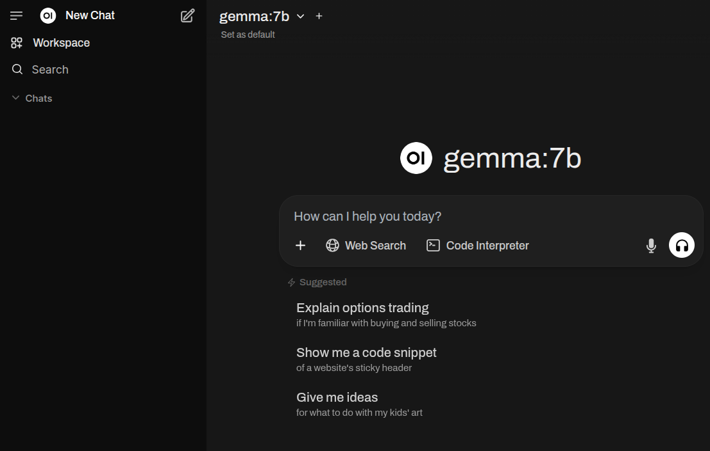

# Exploring OpenWebUI – An Open Source Frontend for LLMs

## Khôi Tran - 08.05.2025

---

## What is OpenWebUI?

A modern, open-source web interface for interacting with large language models (LLMs)

Designed as a user-friendly alternative to commercial offerings like ChatGPT

---

## Background and Motivation

- The rise of local LLMs (e.g. LLaMA, Mistral, Gemma, Deepseek)
- The need for accessible, customizable UIs for non-cloud LLM usage
- Limitations of command-line tools and simple REST interfaces
- Privacy concerns

---

## Features

- Multi-user support with authentication
- Chat history, folders, and tagging
- Model management and switching (e.g. Ollama, but also OpenAI and others)
- Plugin system (e.g., web search, file reading)
- Mobile-responsive design

---

## Features (2)

- Make your own RAG
- File uploads (images)
- Tools
 (Web Search, Image Generation, Weather, OCR, ...) 

---

## Technology

Frontend: Svelte
Backend: Python (fastapi, langchain, chromadb)

---

## Use Cases

- Developers testing custom LLMs
- Educational settings for teaching LLM behavior
- Secure/Private enterprise environments

---

## DEMO

- Multiple models
- llava for image queries
- Workspaces:
 * Models
 * Knowledge `#`
 * Prompts `/`
- Admin functions
- Model parameters

---

## Others

Image generation:

- OpenAI
- ComfyUI

---

## OpenWebUI @ Puzzle?

- Current state
- Integration with Continue for Code Assistance?
- Open for every member?